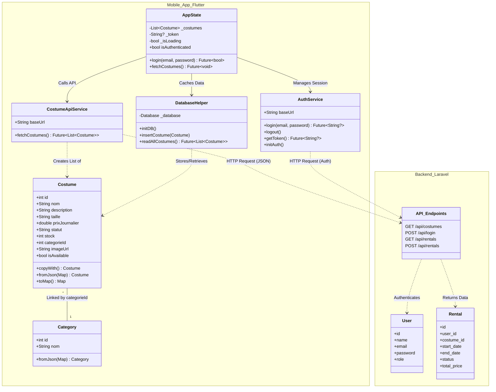

# Class Diagram

This diagram visualizes the architecture of the **Costume Rental System**, separating the **Flutter Mobile App** from the **Laravel Backend**.

It highlights how data flows from the backend database to the mobile application's local storage and UI.

